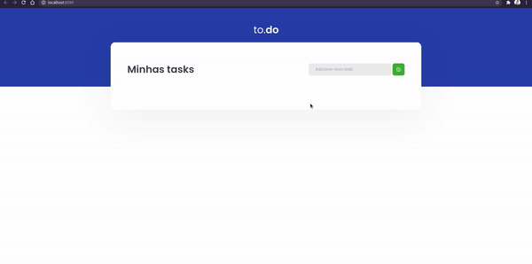

<h2 align="center">
  Ignite - Trilha ReactJS
</h2>

  
  

  <a href="https://github.com/rocketseat-education/ignite-template-reactjs-conceitos-do-react">Template da aplicação</a>

  Desafio: Conceitos do React

## 🚀 Como executar

* Clone o repositório
* Instale as dependências com yarn
* Inicie o servidor com yarn dev
* Agora você pode acessar localhost:8080 do seu navegador.

## :memo: Licença

Esse projeto está sob a licença MIT. Veja o arquivo [LICENSE](LICENSE) para mais detalhes.
